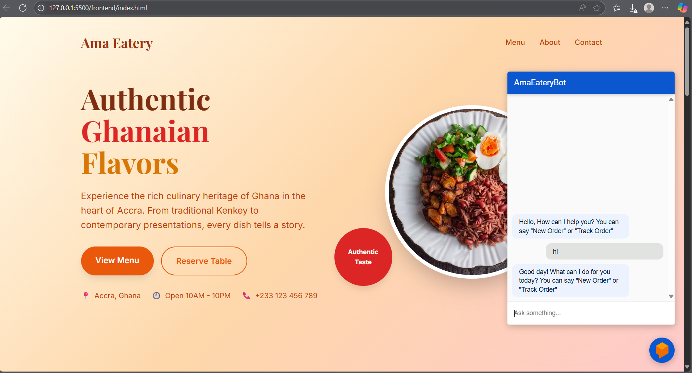
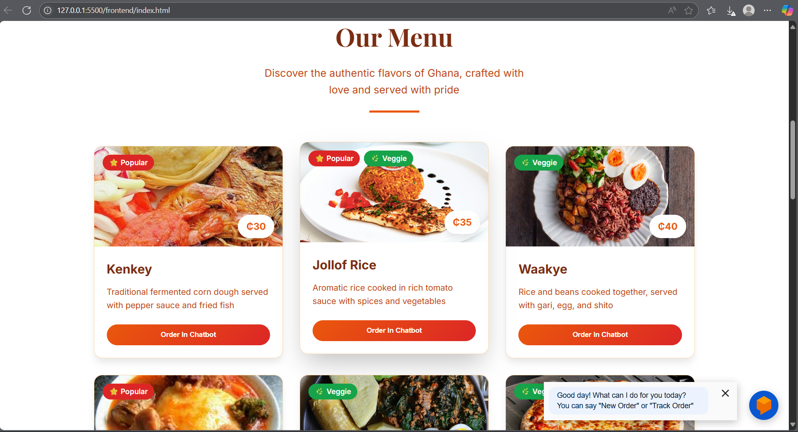
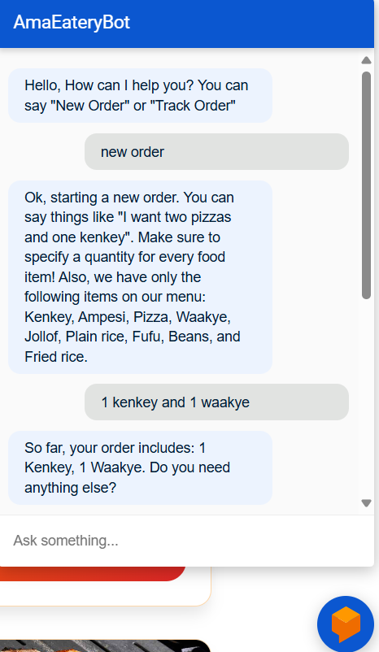
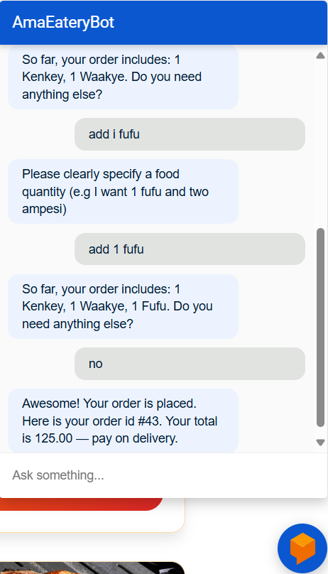
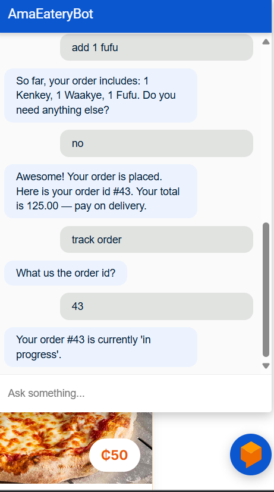
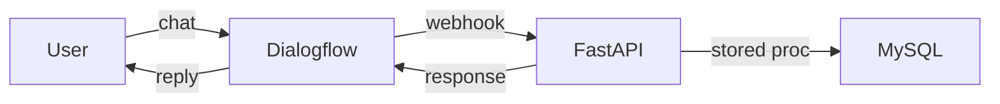

# 🍔💬 AmaBot — AI-Powered Chatbot with FastAPI & Dialogflow

Welcome to **AmaBot** — a fully functional food ordering assistant built with 🧠 Dialogflow for NLP, 🐍 FastAPI for backend logic, and styled using nothing but plain HTML/CSS for a surprisingly cute frontend.

## 🧠 What It Does
AmaBot understands food orders, updates items, tracks existing orders, and responds conversationally. All requests are routed through a FastAPI backend connected to a MySQL database with stored procedures — no hacks, just real engineering.

> Despite the clean and playful interface, the system underneath is seriously robust.

---

## 💡 Features

✅ Dialogflow NLP intents for add/remove/track/complete orders  
✅ FastAPI webhook for real-time fulfillment  
✅ MySQL backend with custom stored procedures  
✅ Ngrok tunnel for exposing local FastAPI server  
✅ Cute and minimal frontend with HTML & CSS only  
✅ Dynamic chatbot color customization  
✅ Fully local setup — no cloud deployment required

---
## ⚙️ Tech Stack

| Layer       | Tech                                                                 |
|-------------|----------------------------------------------------------------------|
| NLP         | 🧠 Google Dialogflow CX                                               |
| Backend     | ⚡ FastAPI, Python 3, Uvicorn                                         |
| Database    | 🗃️ MySQL with Stored Procedures                                      |
| Tunneling   | 🌐 ngrok (to expose local webhook)                                   |
| Frontend    | 🎨 Pure HTML + CSS (no JavaScript frameworks used!)                  |


---

## 🖼️ Frontend Screenshot

<p align="center">
  
  
</p>

> A bright, cheerful UI with a slightly deeper orange touch and original Dialogflow icon branding.

---

## ✨ Conversational Flow in Action

Below is a snapshot of AmaEateryBot smoothly handling a full food order — from adding and removing items to confirming the final request. The chat feels natural, intuitive, and responsive, just like a real conversation.
<p align="center">
  
  
  
</p>

---

## 🔄 How It Works


## 🧪 Sample Intents
- 🧾 Add to Order — ```order.add```
```json
{
  "food-item": ["Jollof", "Kelewele"],
  "number": [1, 2]
}
```
- ❌ Remove Item — ```order.remove```
```json
{
    "food-item": ["Kelewele"],
  "number": [1]
}
```
- ✅ Complete Order — ```order.complete```
```json
{
    "any": ""
}
```
- 🔍 Track Order — ```track.order```
```json
{
  "number": 105
}
```
## ⚡ Local Setup
### 1️⃣ Run Backend
```bash
uvicorn main:app --reload
```

### 2️⃣ Run Tunnel
```bash
ngrok http 8000
```
Paste the ngrok URL into Dialogflow’s webhook settings.

### 3️⃣ Run Frontend
Open this in browser:
```bash
[uvicorn main:app --reload](http://127.0.0.1:5500/frontend/index.html)
```
---
## 💭 Why It Matters
Even with no fancy frontend frameworks, this chatbot project shows how conversational AI can be integrated with real backend logic. It’s proof that:

> ✨ Backend mastery + thoughtful design = delightful user experience.

---
## 🌟 Give It a Star!
If this bot made you smile or taught you something new, don’t forget to ⭐️ the repo and show some love!

---
## 🧑‍💻 Author
Built with ❤️ by **Ama Baduwa Baidoo**

Final-year CS student | NLP enthusiast | Curious technologist | Deep Learning student

“I believe feedback-driven language learning should be both smart and insightful and cute.”


